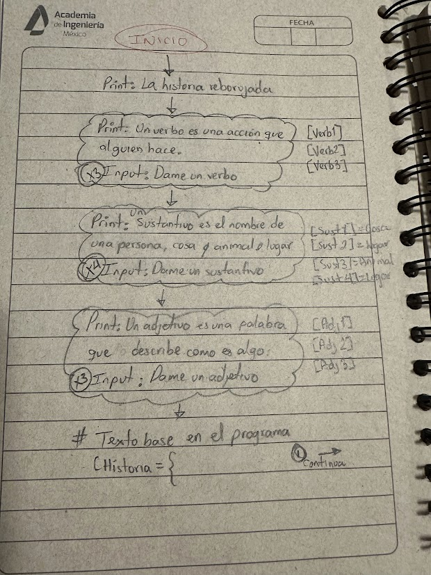
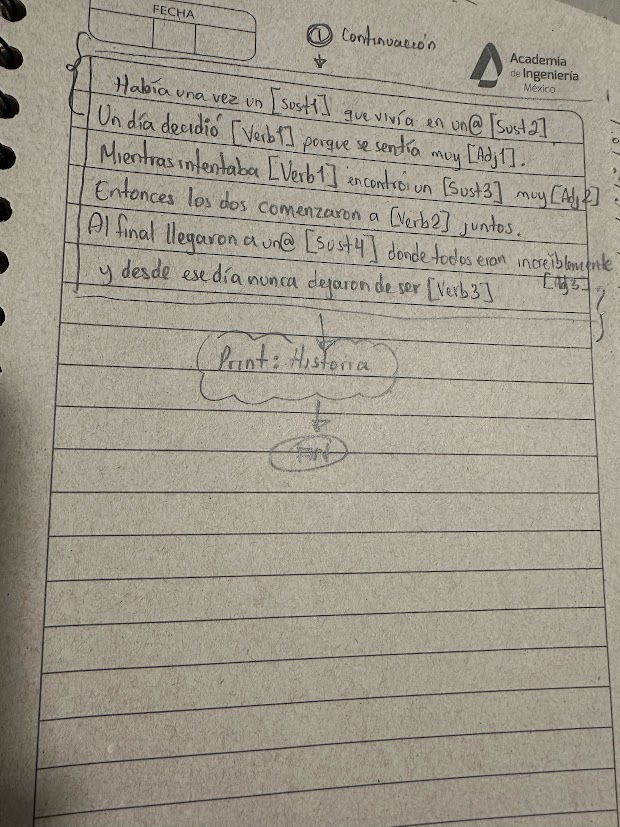

# VERSION EN ESPAÑOL
# CREACION DE UNA HISTORIA - VERBOS, ADJETIVOS, SUSTANTIVOS 

Primer proyecto realizado para mi hija.
Objetivo: 
-Comprension lectora
-Identificacion de sustantivos, adjetivos y verbos 

## Caracteristicas
- Se realiza una historia preguntando cada categoria gramatical 
- Se imprime la historia completa con los sustantivos, adjetivos y verbos proporcionados

## Siguientes pasos
- Implementacion de ciclo while para generar una historia nueva
-Implementacion de de limitacion en escritura, no permitir numeros o caracteres.
- La explicacion de que es un verbo, adjetivo y sustantivos tendra una pequeña parte de examen para corroborar que se entendio cada categoria gramatical (este paso se realizara en otro ejercicio)
-IMPORTANTE: En el futuro crear interfaz en HTML para visualizarlo mejor

## Informacion de referencia
-Sustantivo: Es el nombre de algo, puede ser persona, animal o cosa (Ej: perro, casa, mami, arbol)
-Adjetivo: Es una palabra que describe como es algo (Ej: Alto, grande, inteligente)
-Verbos: Es una accion. Es algo que alguien hace. (Ej:correr, pensar)

## Limitaciones conocidas
-El genero gramatical aun no se ajusta automaticamente
-El plural de los adjetivos aun no se ajusta automaticamente

## Initial Flowchart

Esta es la verion numero 1 de un pequeño programa de estudio para una niña de 6 años