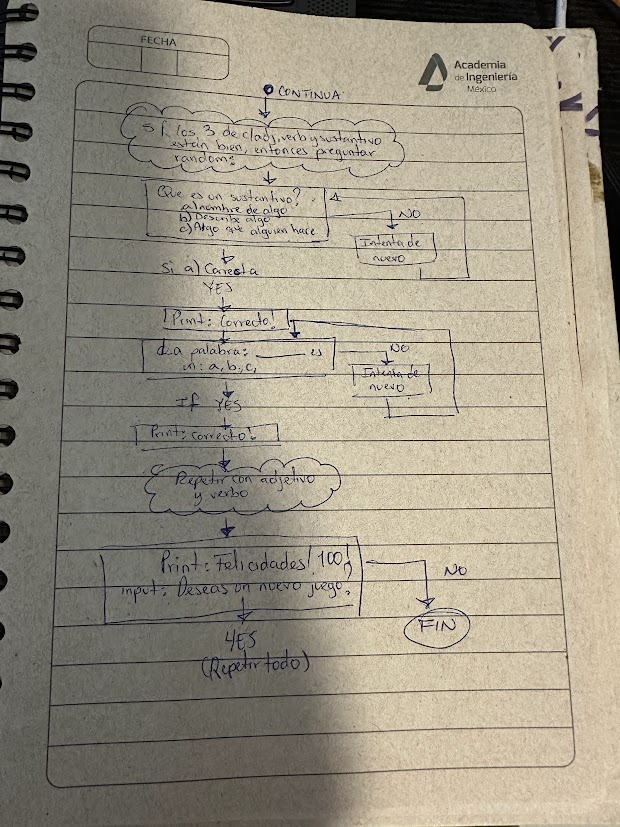

# VERSION EN ESPAÑOL
# APRENDER - VERBOS, ADJETIVOS, SUSTANTIVOS 

Proyecto 2 realizado para mi hija.
Objetivo: 
-Identificacion de sustantivos, adjetivos y verbos 

## Caracteristicas
-Realizar una guia a manera de examen para que aprenda lo que son los verbos, adjetivos y sustantivos

## Siguientes pasos
- Implementacion de de limitacion en escritua, no permitir numeros o caracteres.
-IMPORTANTE: En el futuro crear interfaz en HTML para visualizarlo mejor

## Informacion de referencia
-Sustantivo: Es el nombre de algo, puede ser persona, animal o cosa (Ej: perro, casa, mami, arbol)
-Adjetivo: Es una palabra que describe como es algo (Ej: Alto, grande, inteligente)
-Verbos: Es una accion. Es algo que alguien hace. (Ej:correr, pensar)

## Limitaciones conocidas
-El genero gramatical aun no se ajusta automaticamente
-El plural de los adjetivos aun no se ajusta automaticamente

## Initial Flowchart

---

Esta es la verion numero 1 de un pequeño programa de estudio para una niña de 6 años